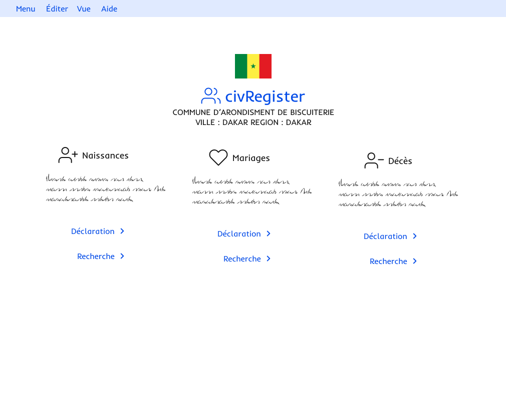

# civRegister

Application d'enregistrement des faits d'état civils

## Comment contribuer à civRegister

Si vous souhaitez aider, lisez nos [consignes de contribution](CONTRIBUTING.md).

Vous pouvez également vous référer à notre [guide de développement](DEVELOPMENT.md) pour plus d'informations.

## Licence

Ce projet est sous licence MIT - voir le fichier [LICENSE](LICENSE) pour plus de détails.
